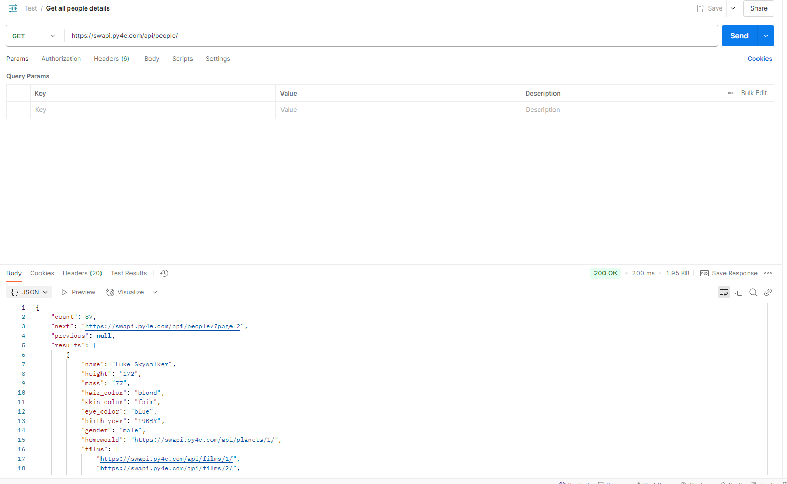

# People
## Get information about all the people

### Method

GET - Retrieves the details of all the people.

### Request URL

https://swapi.dev/api/people

### Response Parameters

|Parameter|Child Parameter|Data Type|Values|Description|
| :----     |     :---   |     :---   |     :---   |     :---   |
|count||integer||Specifies the total number of people.|
|next||nullable string||Specifies the URL of the next page; if none exists, "null" will be displayed.| 
|previous||nullable string||Specifies the URL of the previous page; if none exists, "null" will be displayed.| 
|results||array of objects|||	
||name|string||Specifies the name of the person.|
||height|string||Specifies the height of the person.|
||mass|string||Specifies the mass of the person.|
||hair_color|string||Specifies the hair color of the person.|
||skin_color|string||Specifies the skin color of the person.|
||eye_color|string||Specifies the eye color of the person.|
||birth_year|string||Specifies the birth year of the person.|
||gender|string|Either "Male", "Female" or "unknown", "n/a" if the person does not have a gender.|Specifies the gender of the person.|
||homeworld|string||Specifies the URL of a planet where the person was born or inhabits.|
||films|array of string|Specifies an array of URLs containing information about the films the person has acted.|
||species|nullable array of string||Specifies an array of URLs containing information about the species the person belongs to.|
||vehicles|nullable array of string||Specifies an array of URLs containing information about every vehicle the person has piloted.|
||starships|nullable array of string||Specifies an array of URLs containing information about every spaceship the person has piloted.|
||created|string||Specifies the date and time when the person’s details are created.|
||edited|string||Specifies the date and time the person’s details are edited.|
||url|string||Specifies the URL that contains the person’s details.|

### Response JSON/Example Response

```
{
    "count": 82, 
    "next": "https://swapi.dev/api/people/?page=2", 
    "previous": null, 
    "results": [
        {
            "name": "Luke Skywalker", 
            "height": "172", 
            "mass": "77", 
            "hair_color": "blond", 
            "skin_color": "fair", 
            "eye_color": "blue", 
            "birth_year": "19BBY", 
            "gender": "male", 
            "homeworld": "https://swapi.dev/api/planets/1/", 
            "films": [
                "https://swapi.dev/api/films/1/", 
                "https://swapi.dev/api/films/2/", 
                "https://swapi.dev/api/films/3/", 
                "https://swapi.dev/api/films/6/"
            ], 
            "species": [], 
            "vehicles": [
                "https://swapi.dev/api/vehicles/14/", 
                "https://swapi.dev/api/vehicles/30/"
            ], 
            "starships": [
                "https://swapi.dev/api/starships/12/", 
                "https://swapi.dev/api/starships/22/"
            ], 
            "created": "2014-12-09T13:50:51.644000Z", 
            "edited": "2014-12-20T21:17:56.891000Z", 
            "url": "https://swapi.dev/api/people/1/"
        }]}
```

### Response Status Code

200 - OK

404 - NOT FOUND

### Success screenshot

